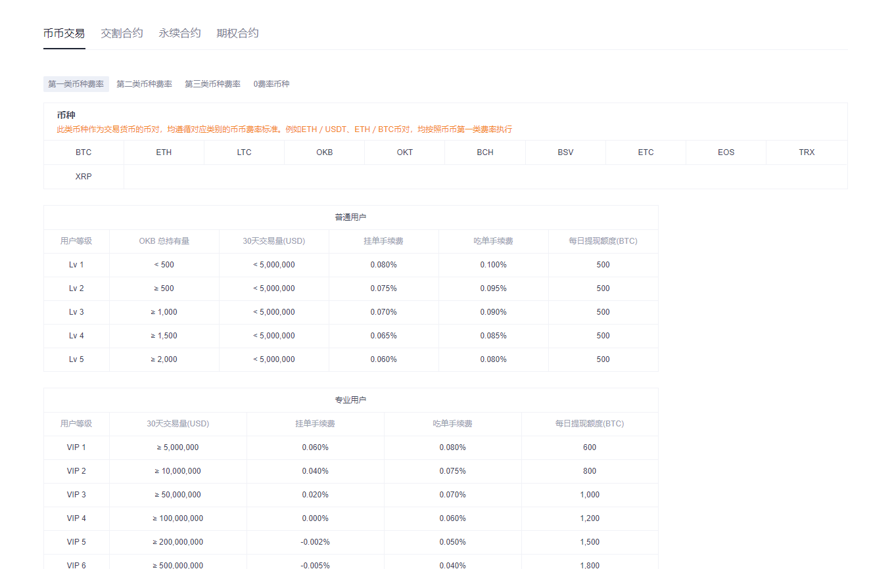
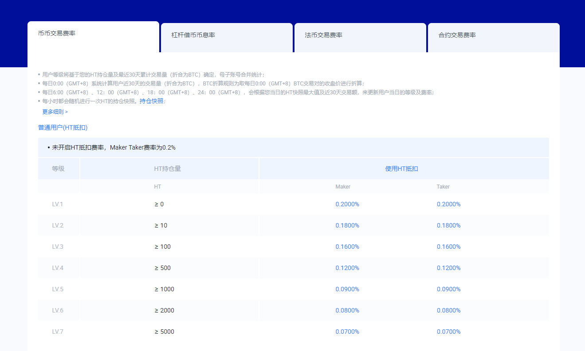
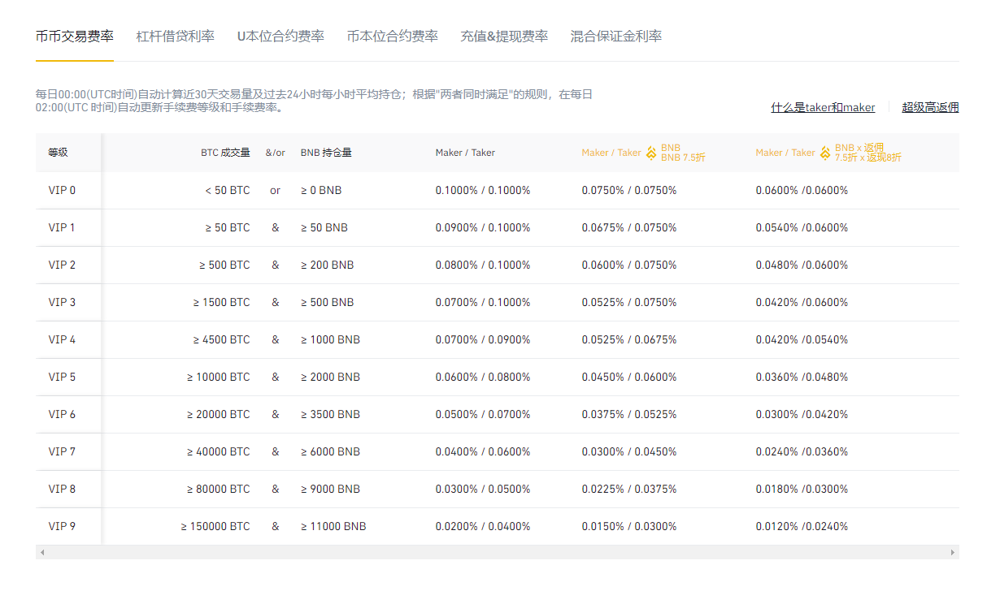

# Tools

## Build Setup

```bash
# install dependencies
$ yarn install

# serve with hot reload at localhost:3000
$ yarn dev

# build for production and launch server
$ yarn build
$ yarn start

# generate static project
$ yarn generate
```

For detailed explanation on how things work, check out [Nuxt.js docs](https://nuxtjs.org).

## 补充扩展

### 交易所API文档

```shell
https://docs.kucoin.com/
https://www.okex.com/docs/
https://huobiapi.github.io/docs/
https://binance-docs.github.io/apidocs/
https://docs.pro.coinbase.com/
https://docs.ftx.com/
https://coinmarketcap.com/rankings/exchanges/
```

### 交易费率

- OKEx 手续费

```shell
# 2021/3/13 获取
https://www.okex.com/cn/fees.html
```



- 火币手续费

```shell
# 2021/3/13 获取
https://www.huobi.com/zh-cn/fee/
```



- 币安手续费

```shell
# 2021/3/13 获取
https://www.binance.com/zh-CN/fee/schedule
```


